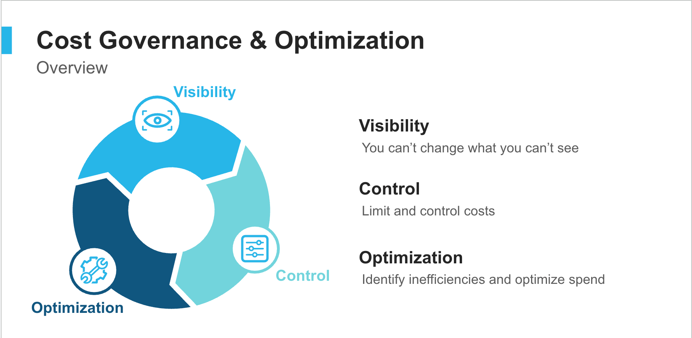

# Snowflake Cost Management HOL: Implementing Budgets and Resource Monitors
**Master cost control and gain visibility into Snowflake spending with hands-on budget management.**



---

## 🛠️ Hands-On Lab Overview

In this hands-on lab, you'll step into the shoes of a **Snowflake Administrator** tasked with **implementing comprehensive cost management controls** to provide visibility and control over Snowflake spending.

Customers frequently express concerns about cloud costs. This lab addresses those concerns by demonstrating Snowflake's built-in cost management capabilities: **Budgets** for spending visibility, **Resource Monitors** for proactive control, and **Role-Based Access Control** for empowering teams with cost awareness.

### 📋 What You'll Do:

- **Task 1:** Configure **email notifications** and set up a dedicated warehouse for cost management queries in Snowsight.
- **Task 2:** Enable the **account-level budget** to monitor total monthly spending and configure **custom budgets** for specific resources (warehouses and databases).
- **Task 3:** Create **role-based access controls** to allow non-ACCOUNTADMIN users to view budget information without editing privileges.
- **Task 4:** Implement **best practices** for budget management, warehouse optimization, and cost monitoring in production environments.
- **Task 5:** Configure **Resource Monitors** with hard spending limits and suspension triggers for automated cost control.

Detailed instruction on executing the scripts can be found [HERE](lab_instructions/README.md)

### ⏲️ Estimated Lab Timeline

This lab is designed to be completed in approximately 60-90 minutes:

- **Phase 1 (Setup & Prerequisites):** ~15-20 min
  - Configure email notifications
  - Create Snowsight warehouse
  - Navigate Cost Management interface
  
- **Phase 2 (Setting Up Budgets):** ~20-25 min
  - Enable account-level budget
  - Create custom budgets
  - Understand resource assignment behavior
  
- **Phase 3 (Access Control):** ~20-25 min
  - Create budget monitor roles
  - Configure granular access
  - Test role-based visibility
  
- **Phase 4 (Cleanup & Best Practices):** ~10-15 min
  - Clean up lab resources
  - Review production deployment guidelines
  - Learn ongoing optimization strategies

---

## 📖 Table of Contents

- [Why this Matters](#-why-this-matters)
- [Suggested Discovery Questions](#-suggested-discovery-questions)
- [Repository Structure](#-repository-structure)
- [Prerequisites & Setup Details](#-prerequisites--setup-details)
- [Lab Execution Guide](#-lab-execution-guide)
- [Lab Validation & Grading](#-lab-validation--grading)
- [Cleanup & Cost-Stewardship Procedures](#-cleanup--cost-stewardship-procedures)
- [Advanced Concepts](#-advanced-concepts)
- [Links to Snowflake Resources & Documentation](#-links-to-snowflake-resources--documentation)
- [Author & Support](#-author--support)

---

## 📌 Why this Matters

### Business Value
- **Cost Transparency:** Budgets provide real-time visibility into spending, enabling data-driven financial decisions and reducing surprise overspending by up to 40%.
- **Proactive Control:** Email notifications and resource monitors alert teams when spending exceeds thresholds, preventing budget overruns before they happen.
- **Cross-Team Accountability:** Custom budgets enable department-specific cost tracking, promoting accountability and encouraging teams to optimize their resource usage.
- **Faster Decision-Making:** With granular cost insights, teams can quickly identify optimization opportunities, potentially reducing monthly costs by 15-30%.

### Pricing Impact
- **Compute Costs:** Warehouses typically account for 70-80% of Snowflake spending. This lab teaches you to monitor and control warehouse costs effectively.
- **Storage Costs:** Understanding storage consumption patterns helps optimize data retention policies and reduce unnecessary storage fees.
- **Cost Efficiency:** Implementing auto-suspend (60-300 seconds) can reduce idle warehouse costs by up to 90%.
- **Budget Adherence:** Organizations using budgets report 25-35% better adherence to planned spending vs. those without cost management controls.

---

## ❓ Suggested Discovery Questions

Use these open-ended questions during customer conversations to understand their cost management needs:

1. **"How are you currently monitoring and controlling your Snowflake spending?"**
   - Uncover whether they have visibility into costs or are flying blind

2. **"What challenges have you faced with usage-based pricing models in the past?"**
   - Identify pain points and concerns about cost predictability

3. **"Do your individual teams or departments have visibility into their own Snowflake costs?"**
   - Determine if they need custom budgets for chargeback or showback

4. **"How quickly do you need to be notified when spending exceeds expected levels?"**
   - Understand their alerting and notification requirements

5. **"What approval processes exist for increasing cloud spending budgets?"**
   - Learn about their governance and financial controls

6. **"Have you experienced any unexpected spikes in Snowflake costs? What caused them?"**
   - Identify patterns that budgets and resource monitors could prevent

7. **"What metrics matter most when evaluating the ROI of your data platform spending?"**
   - Understand how they measure value vs. cost

---

## 📂 Repository Structure

```bash
├── README.md                          # Main entry point (this file)
├── LAB_INSTRUCTIONS.md 
│   ├── README.md
│   ├── phase1_setup_and_prerequisites.md
│   ├── phase2_setting_up_budgets.md
│   ├── phase3_access_control_for_budgets.md
│   └── phase4_cleanup_and_best_practices.md
├── images/                             # Diagrams and visual assets
├── scripts/                           # SQL scripts for lab execution
│   ├── 01_setup_email_notifications.sql
│   ├── 02_create_snowsight_warehouse.sql
│   ├── 03_create_budget_database.sql
│   ├── 04_create_account_budget_monitor_role.sql
│   ├── 05_create_custom_budget_monitor_role.sql
│   ├── 06_view_budget_linked_resources.sql
│   └── 07_cleanup_budgets.sql     
├── Config/                           # Validation scripts for lab completion
│   ├── README.md                # Grading instructions
│   ├── DoraGrading_01_setup_prerequisites.sql
│   ├── DoraGrading_02_budgets_setup.sql
│   ├── DoraGrading_03_access_control.sql
│   └── DoraGrading_Complete.sql       
└── troubleshooting/                   # Common issues and resolutions
```

---

## ✅ Prerequisites & Setup Details

### Knowledge Prerequisites
- **Snowflake Fundamentals:** Basic understanding of Snowflake architecture, roles, and warehouses
- **SQL Proficiency:** Ability to read and execute SQL statements
- **Role-Based Access Control (RBAC):** Familiarity with Snowflake's role hierarchy
- **No Advanced Skills Required:** This lab is suitable for Snowflake beginners

### Account and Entitlement Checks
- **Required Role:** ACCOUNTADMIN access (for creating budgets and roles)
- **Snowflake Edition:** Any edition (Standard, Enterprise, Business Critical)
- **Account Type:** Trial or production account (both supported)
- **Features Used:**
  - Snowsight UI (web interface)
  - Cost Management features
  - Budget objects (native Snowflake feature)

### Setup Checklist
Before starting the lab, ensure:
- [ ] You have ACCOUNTADMIN role access
- [ ] Your Snowflake account is accessible via Snowsight
- [ ] You have a valid, verified email address
- [ ] You have at least 2-3 existing warehouses in your account (for adding to custom budgets)

---

## 🚀 Lab Execution Guide

Detailed instruction on executing the scripts can be found 
[HERE](lab_instructions/README.md) 


---

## ✅ Lab Validation & Grading
Detailed instructions on Grading can be found [HERE](config/README.md)

---
## 🧹 Cleanup & Cost-Stewardship Procedures
   **Purpose:** Clean up custom budgets created during the lab
   
   [Script to Execute](/scripts/07_cleanup_budgets.sql)

---
## 📘 Advanced Concepts

### Resource Monitors vs. Budgets

**Budgets (Covered in This Lab):**
- Provide **notifications** when spending thresholds are reached
- No automatic enforcement (informational only)
- Can be viewed by non-admin roles
- Best for: Visibility and awareness

**Resource Monitors (Advanced Topic):**
- Provide **hard limits** with automatic warehouse suspension
- Can prevent overspending by stopping compute
- Require ACCOUNTADMIN to configure
- Best for: Strict cost control

**Example Resource Monitor:**
```sql
CREATE RESOURCE MONITOR PROD_LIMIT
  WITH CREDIT_QUOTA = 1000
  FREQUENCY = MONTHLY
  START_TIMESTAMP = IMMEDIATELY
  TRIGGERS
    ON 75 PERCENT DO NOTIFY
    ON 90 PERCENT DO SUSPEND
    ON 100 PERCENT DO SUSPEND_IMMEDIATE;

ALTER WAREHOUSE PRODUCTION_WH SET RESOURCE_MONITOR = PROD_LIMIT;
```

---

### Query Optimization for Cost Reduction

**Techniques to Reduce Compute Costs:**

1. **Result Caching:** Reuse results from recent identical queries (24-hour cache)
```sql
-- Automatic - no configuration needed
-- Subsequent runs of the same query use cache (0 compute cost)
```
2. **Clustering Keys:** Optimize pruning for large tables
```sql
ALTER TABLE large_table CLUSTER BY (date_column, category);
```

3. **Materialized Views:** Pre-compute complex aggregations
```sql
CREATE MATERIALIZED VIEW daily_summary AS
SELECT date, category, SUM(amount) as total
FROM transactions
GROUP BY date, category;
```

4. **Query Profiling:** Identify expensive operations
- Use Snowsight Query Profile to analyze query performance
- Look for: Full table scans, large data spilling, inefficient joins

---

### Multi-Environment Budget Strategy

**Recommended Approach for Production:**

```
Account Budget: $10,000/month (organization total)
├── Production Environment Budget: $6,000/month
│   ├── API Warehouse: Resource Monitor at $2,000/month
│   ├── Analytics Warehouse: Resource Monitor at $3,000/month
│   └── ETL Warehouse: Resource Monitor at $1,000/month
├── Development Environment Budget: $2,000/month
│   ├── Dev Warehouse: Resource Monitor at $1,500/month
│   └── Test Warehouse: Resource Monitor at $500/month
└── Sandbox Environment Budget: $2,000/month
    └── Individual user warehouses: $200/month each
```

**Benefits:**
- Hierarchical visibility at multiple levels
- Hard limits prevent runaway costs in lower environments
- Chargeback/showback to business units
- Clear accountability per team/project

---

## 🔗 Links to Snowflake Resources & Documentation

### Official Snowflake Documentation

#### Budgets:
- [Monitoring Credit Usage with Budgets](https://docs.snowflake.com/en/user-guide/budgets)

#### Cost Management:
- [Cost Management Overview](https://docs.snowflake.com/en/user-guide/cost-management-overview)
- [Exploring Cost Data](https://docs.snowflake.com/en/user-guide/cost-exploring)
- [Understanding Compute Cost](https://docs.snowflake.com/en/user-guide/cost-understanding-compute)

#### Resource Monitors:
- [Resource Monitors Overview](https://docs.snowflake.com/en/user-guide/resource-monitors)
- [Warehouse Credit Usage and Monitoring](https://docs.snowflake.com/en/user-guide/credits)

---

## 👤 Author & Support

**Lab created by:** Aparna Nadimpalli – SE Enablement Senior Manager  
**Created on:** October 29, 2025 | **Last updated:** November 17, 2025 

💬 **Need Help or Have Feedback?**  
- Slack Channel: [#College-of-Platform](https://snowflake.enterprise.slack.com/archives/C0A3K5FT4UF)  
- Slack DM: [@aparna.nadimpalli](https://snowflake.enterprise.slack.com/team/U03RQG03MJR)  
- Email: [aparna.nadimpalli@snowflake.com](mailto:aparna.nadimpalli@snowflake.com)

🌟 *We greatly value your feedback to continuously improve our HOL experiences!*

---

## 🎉 Congratulations!

By completing this lab, you've gained hands-on experience with:
- ✅ Configuring account and custom budgets in Snowflake
- ✅ Setting up role-based access to cost information
- ✅ Implementing cost management best practices
- ✅ Understanding Snowflake's usage-based pricing controls
- ✅ Deploying production-ready cost governance

**Next Steps:**
- Apply these techniques in your own Snowflake account
- Set up budgets for your teams or projects
- Configure resource monitors for critical warehouses
- Share cost management capabilities with your finance team
- Explore advanced optimization techniques in Snowflake documentation

**Continue Learning:**
- Explore Snowflake's Account Usage views for deeper cost analysis
- Learn about Time Travel and Fail-Safe storage costs
- Investigate Snowpipe and task credit consumption
- Study query optimization techniques for cost reduction

---

🌟 *Thank you for completing the Snowflake Cost Management Hands-On Lab! We hope this empowers you to help customers realize the value of Snowflake's usage-based pricing model with confidence and control.*

